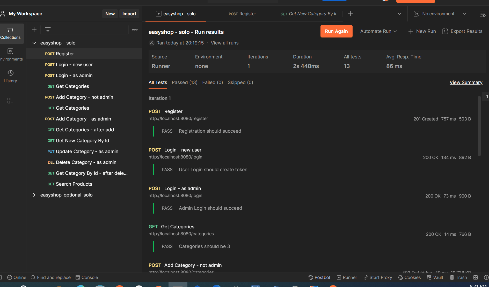
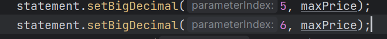
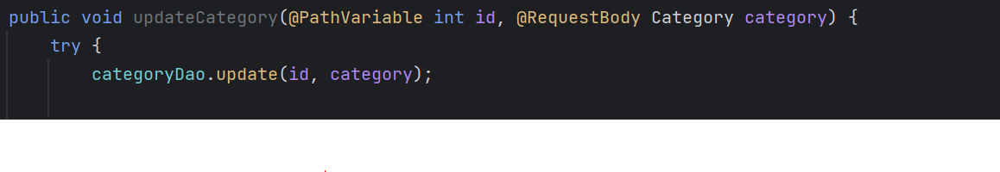

# Project Title

EasyShop

## Description of the Project
EasyShop is an online shop application it contains backend code for easyShop, an online shop application.
Spring Boot based platform that handles various aspects of online shopping, including user authentication,
product management, and order processing. Spring boot framework for rapid development and easy configuration. provides built_in support
for dependency injection, making the code modular and easier to maintain. Used mysql for database management and implement a
spring security for user authentication and authorization its ensure the authorized user can access certain endpoints.
A RESTful API backend exposes the various operations such as retrieving products, managing shopping cart, and processing orders.
The Shopping cart controller class provides methods for handling shopping cart-related actions. The project has been divided into two 
phase, each focusing on specific tasks and bug fix. Development spring boot tools for swapping, making the development process 
more efficient.

## User Stories

Click [here]([https://github.com/users/AbiramiThavamani/projects/8]

### Prerequisites

- IntelliJ IDEA: Ensure you have IntelliJ IDEA installed, which you can download from [here](https://www.jetbrains.com/idea/download/).
- Java SDK: Make sure Java SDK is installed and configured in IntelliJ.

### Running the Application in IntelliJ

Follow these steps to get your application running within IntelliJ IDEA:

1. Open IntelliJ IDEA.
2. Select "Open" and navigate to the directory where you cloned or downloaded the project.
3. After the project opens, wait for IntelliJ to index the files and set up the project.
4. Find the main class with the `public static void main(String[] args)` method.
5. Right-click on the file and select 'Run 'YourMainClassName.main()'' to start the application.

## Technologies Used

- Intellij IDEA version 2022.3.2
- JAVA 17

## Demo
PostMan

EasyShop Web Application

Bug 1 
missing clause in the sql query adding the following clause to the query

search method required maximum price

Bug 2
Product update to fix modifying code inside the product Controller class method

## Future Work

Additional feature to be developed.

- Implement an in-app messaging system for direct communication between customer and support.

Improvement of current functionalities.

- Enable customers to leave reviews and rating for the products.

## Resources
workbook7 https://app.schoology.com/course/7241485878/materials/gp/7241486219

workbook8 https://app.schoology.com/course/7241485878/materials/gp/7241486247

workbook9 https://app.schoology.com/course/7241485878/materials/gp/7241486256

## Thanks

- Thank you to Raymond Maroun for continuous support and guidance and continuous encouragement
throughout this journey.

